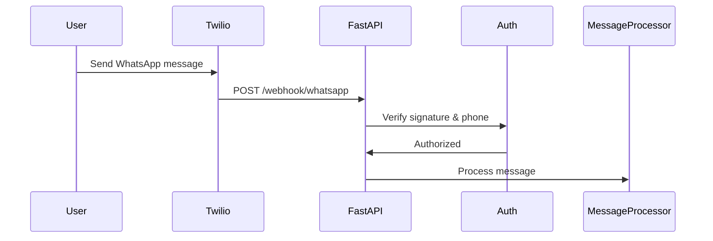
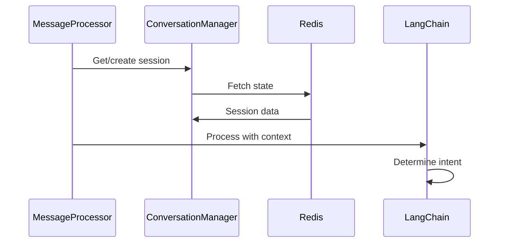
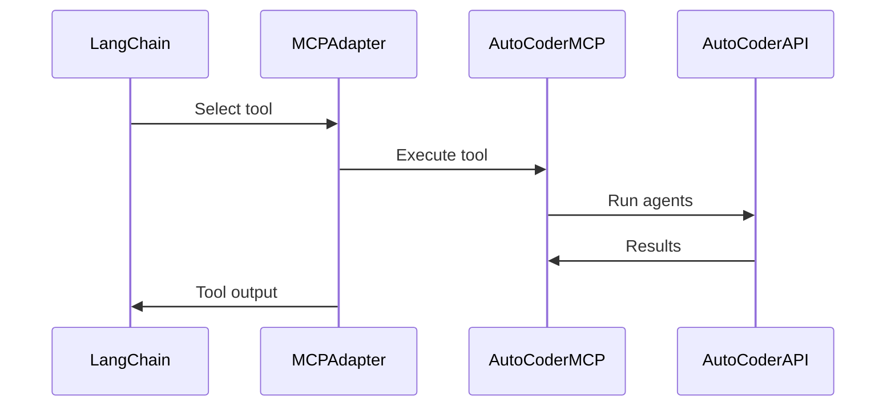
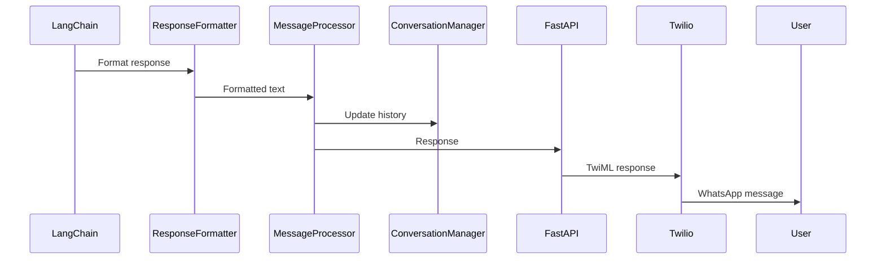

# WhatsApp-AutoCoder Agent System Documentation

## Overview

The WhatsApp-AutoCoder integration creates an intelligent conversational interface that connects WhatsApp users with the AutoCoder multi-agent development platform. This system leverages LangChain for natural language understanding and the AutoCoder MCP (Model Context Protocol) server for executing coding tasks.

## System Architecture

### Core Components

#### 1. WhatsApp Interface Layer
- **Technology**: Twilio WhatsApp Business API
- **Purpose**: Receives and sends WhatsApp messages
- **Responsibilities**:
  - Webhook handling for incoming messages
  - Message delivery status tracking
  - Media attachment handling
  - TwiML response generation

#### 2. FastAPI Service Layer
- **Technology**: FastAPI, Uvicorn
- **Purpose**: Main application server
- **Responsibilities**:
  - Request validation and authentication
  - Webhook signature verification
  - Request routing and processing
  - Error handling and logging

#### 3. LangChain Agent Layer
- **Technology**: LangChain, LangChain-MCP Adapters
- **Purpose**: Natural language understanding and task orchestration
- **Agent Configuration**:
  ```python
  agent = ConversationalAgent(
      llm=ChatOpenAI(model="gpt-4"),
      tools=[MCPToolkit()],
      memory=ConversationBufferWindowMemory(k=10),
      system_prompt=WHATSAPP_SYSTEM_PROMPT
  )
  ```
- **Responsibilities**:
  - Intent recognition
  - Context management
  - Tool selection and execution
  - Response generation

#### 4. MCP Integration Layer
- **Technology**: MCP Client, WebSocket/HTTP
- **Purpose**: Bridge to AutoCoder capabilities
- **Available Tools**:
  - `create_project` - Initialize new coding projects
  - `list_projects` - Retrieve user's projects
  - `execute_coding_task` - Run multi-agent coding workflow
  - `get_session_details` - Check task execution status
  - `get_session_files` - Access generated code files
  - `check_system_health` - Monitor system status

#### 5. State Management Layer
- **Technology**: Redis, Python asyncio
- **Purpose**: Maintain conversation state and context
- **Data Structures**:
  ```json
  {
    "phone_number": "+1234567890",
    "session_id": "sess_abc123",
    "active_project": "proj_xyz789",
    "conversation_history": [...],
    "context": {...},
    "preferences": {...}
  }
  ```

## AutoCoder Agent Integration

### Connected AutoCoder Agents

The WhatsApp interface provides access to all six specialized AutoCoder agents:

#### 1. Planner Agent
- **Access via**: Natural language project descriptions
- **Example**: "Create a web application with user authentication"
- **MCP Tool**: `execute_coding_task` with planning phase

#### 2. Developer Agent
- **Access via**: Code generation requests
- **Example**: "Generate the backend API code"
- **MCP Tool**: `execute_coding_task` with development phase

#### 3. Tester Agent
- **Access via**: Testing requests
- **Example**: "Write unit tests for the authentication module"
- **MCP Tool**: `execute_coding_task` with testing phase

#### 4. UI/UX Expert Agent
- **Access via**: Design and frontend requests
- **Example**: "Design a modern dashboard interface"
- **MCP Tool**: `execute_coding_task` with UI/UX phase

#### 5. Database Expert Agent
- **Access via**: Database and data modeling requests
- **Example**: "Design a schema for e-commerce data"
- **MCP Tool**: `execute_coding_task` with database phase

#### 6. DevOps Expert Agent
- **Access via**: Deployment and infrastructure requests
- **Example**: "Create Docker configuration for deployment"
- **MCP Tool**: `execute_coding_task` with DevOps phase

## Conversation Flow

### 1. Message Reception


### 2. Intent Processing


### 3. Tool Execution


### 4. Response Generation


## MCP Tool Descriptions

### Project Management Tools

#### create_project
```python
@mcp_tool
async def create_project(name: str, description: str) -> Dict:
    """
    Creates a new development project in AutoCoder.
    
    Args:
        name: Project name
        description: Project description
    
    Returns:
        project_id, name, description, created_at
    """
```

#### list_projects
```python
@mcp_tool
async def list_projects() -> List[Dict]:
    """
    Lists all projects for the current user.
    
    Returns:
        List of projects with id, name, description, status
    """
```

### Task Execution Tools

#### execute_coding_task
```python
@mcp_tool
async def execute_coding_task(
    session_id: str,
    agents: List[str] = None
) -> Dict:
    """
    Executes a coding task using AutoCoder agents.
    
    Args:
        session_id: Session identifier
        agents: Specific agents to use (optional)
    
    Returns:
        execution_id, status, logs, generated_files
    """
```

#### get_session_details
```python
@mcp_tool
async def get_session_details(session_id: str) -> Dict:
    """
    Gets detailed information about a coding session.
    
    Args:
        session_id: Session identifier
    
    Returns:
        session_id, project_id, task, status, progress, logs
    """
```

### File Management Tools

#### get_session_files
```python
@mcp_tool
async def get_session_files(session_id: str) -> List[Dict]:
    """
    Retrieves files generated during a session.
    
    Args:
        session_id: Session identifier
    
    Returns:
        List of files with name, path, size, download_url
    """
```

## Prompt Engineering

### System Prompt for WhatsApp Context
```python
WHATSAPP_SYSTEM_PROMPT = """
You are an AI coding assistant accessible via WhatsApp. You help users create software projects using the AutoCoder platform.

Guidelines:
1. Keep responses concise (max 1600 characters)
2. Use WhatsApp formatting: *bold*, _italic_, ```code```
3. Provide clear, actionable responses
4. Use emojis sparingly for clarity
5. Break complex responses into multiple messages if needed

Available capabilities:
- Create and manage coding projects
- Generate code using specialized AI agents
- Execute complete development workflows
- Provide real-time status updates
- Share generated files

When users describe what they want to build:
1. Understand their requirements
2. Create a project if needed
3. Execute the appropriate coding task
4. Provide status updates
5. Share the results

Always be helpful, professional, and focused on delivering working code.
"""
```

## State Management

### Conversation State Model
```python
class ConversationState:
    phone_number: str
    session_id: str
    active_project: Optional[ProjectContext]
    conversation_history: List[Message]
    context: Dict[str, Any]
    preferences: UserPreferences
    created_at: datetime
    last_activity: datetime
    ttl: int = 86400  # 24 hours
```

### Redis Key Structure
```
conversation:{phone_number} -> JSON(ConversationState)
project:{project_id}:users -> SET(phone_numbers)
user:{phone_number}:projects -> LIST(project_ids)
session:{session_id} -> JSON(SessionData)
rate_limit:{phone_number} -> INT(request_count)
```

## Error Handling Strategy

### Error Categories

1. **User Errors**
   - Invalid commands
   - Missing parameters
   - Unauthorized access
   - Response: Clear error message with guidance

2. **System Errors**
   - AutoCoder unavailable
   - MCP connection failure
   - Redis connection lost
   - Response: Graceful degradation with cached responses

3. **External Errors**
   - Twilio API issues
   - Network timeouts
   - Rate limit exceeded
   - Response: Retry with exponential backoff

### Error Response Templates
```python
ERROR_TEMPLATES = {
    "unauthorized": "🔒 Your phone number is not authorized. Please contact the administrator.",
    "rate_limit": "⏱️ Too many requests. Please wait a moment before trying again.",
    "connection": "❌ Connection error. The service is temporarily unavailable.",
    "invalid_command": "❓ Unknown command: {command}. Type /help for available commands.",
    "project_not_found": "📂 Project not found. Use /list to see your projects."
}
```

## Performance Optimization

### Caching Strategy
- Cache project lists for 5 minutes
- Cache file lists for 10 minutes
- Cache system status for 1 minute
- Use Redis with appropriate TTLs

### Async Processing
- All I/O operations are async
- Concurrent MCP tool execution when possible
- Background task processing for long operations
- WebSocket connections for real-time updates

### Rate Limiting
- Per-phone: 10 requests/minute
- Global: 100 requests/minute
- Exponential backoff on rate limit hit
- Priority queue for authenticated users

## Security Measures

### Authentication Flow
1. Twilio signature verification
2. Phone number whitelist check
3. Rate limit verification
4. Session token generation
5. Context isolation per user

### Data Protection
- No message content in logs (production)
- Encrypted Redis storage
- Session expiry after 24 hours
- Secure file URL generation with expiry
- Input sanitization for all user inputs

## Monitoring and Observability

### Metrics to Track
- Message processing time
- MCP tool execution duration
- Error rates by type
- User engagement metrics
- Session duration and completion rates

### Logging Structure
```json
{
  "timestamp": "2024-01-19T10:30:00Z",
  "level": "INFO",
  "service": "whatsapp-coder",
  "component": "message_processor",
  "trace_id": "abc123",
  "phone_number_hash": "hash_xyz",
  "event": "message_processed",
  "duration_ms": 1234,
  "mcp_tools_used": ["create_project"],
  "success": true
}
```

## Future Enhancements

### Phase 2 Features
- Voice note transcription and processing
- Image input for UI/UX design references
- Multi-language support (Spanish, Portuguese, etc.)
- User preference learning and adaptation
- Project templates and shortcuts

### Phase 3 Features
- WhatsApp Business API for enterprise
- Team collaboration with shared projects
- Code review workflows
- Continuous deployment integration
- Custom agent configuration per user

## Integration Points

### External Services
- **Twilio**: WhatsApp messaging
- **OpenAI**: LLM for natural language processing
- **AutoCoder**: Multi-agent coding platform
- **Redis**: State management
- **AWS S3**: File storage (optional)
- **GitHub**: Code repository integration (future)

### API Endpoints
- `POST /webhook/whatsapp` - Twilio webhook
- `POST /webhook/status` - Delivery status
- `GET /health` - Health check
- `GET /metrics` - Prometheus metrics
- `GET /docs` - API documentation

## Development Workflow

### Local Development
1. Start Redis: `docker run -d -p 6379:6379 redis:alpine`
2. Start AutoCoder: `python enhanced_main.py web --port 5000`
3. Start WhatsApp-Coder: `uvicorn app.main:app --reload`
4. Use ngrok for Twilio webhooks: `ngrok http 8000`

### Testing Strategy
- Unit tests for each service
- Integration tests for MCP tools
- End-to-end tests with mock Twilio
- Load testing with concurrent users
- Security testing for authentication

### Deployment
- Docker containers for all services
- Kubernetes for orchestration
- GitHub Actions for CI/CD
- Blue-green deployment strategy
- Automated rollback on failures
