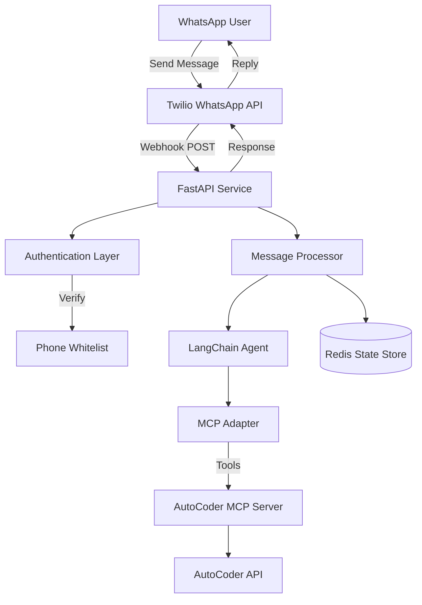

# WhatsApp-AutoCoder Integration Architecture

## Overview

This system creates a WhatsApp interface for AutoCoder, allowing users to interact with the AI coding assistant through WhatsApp messages. The architecture leverages Twilio for WhatsApp integration, LangChain for natural language processing, and the AutoCoder MCP (Model Context Protocol) server for executing coding tasks.

## System Architecture



## Core Components

### 1. FastAPI Service
- **Purpose**: Main application server handling Twilio webhooks
- **Endpoints**:
  - `POST /webhook/whatsapp` - Receives incoming WhatsApp messages
  - `POST /webhook/status` - Receives delivery status callbacks
  - `GET /health` - Health check endpoint
- **Technologies**: FastAPI, Uvicorn, Pydantic

### 2. Authentication System
- **Phone Whitelist**: Environment variable with allowed phone numbers
- **Twilio Signature Verification**: Validates webhook authenticity
- **Rate Limiting**: Prevents abuse (10 requests/minute per phone)
- **Middleware**: FastAPI middleware for request validation

### 3. LangChain Integration
- **Agent**: LangChain agent with conversation memory
- **MCP Tools**: Integration with AutoCoder MCP server tools
- **Prompt Engineering**: WhatsApp-optimized prompts
- **Memory**: Conversation history management

### 4. MCP Adapter
- **Connection**: Connects to AutoCoder MCP server at localhost:5000
- **Available Tools**:
  - `create_project` - Create new coding projects
  - `list_projects` - List all user projects
  - `execute_coding_task` - Run coding tasks with AI agents
  - `get_session_details` - Get task execution status
  - `get_session_files` - Retrieve generated files
  - `check_system_health` - Verify system status

### 5. State Management
- **Redis**: Persistent conversation state storage
- **Session TTL**: 24-hour conversation sessions
- **User Context**: Track active projects per user
- **Conversation History**: Maintain chat context

### 6. Message Processing Pipeline
```
Incoming Message → Parse Intent → Route to LangChain → Execute MCP Tool → Format Response → Send Reply
```

## Data Flow

### Incoming Message Flow
1. User sends WhatsApp message to Twilio number
2. Twilio sends webhook POST to FastAPI endpoint
3. Authentication middleware verifies:
   - Twilio signature
   - Phone number in whitelist
4. Message processor extracts:
   - Phone number
   - Message content
   - Media attachments (if any)
5. Conversation manager retrieves user session from Redis
6. LangChain agent processes message with context
7. MCP adapter executes appropriate AutoCoder tools
8. Response formatter creates WhatsApp-friendly reply
9. FastAPI sends response to Twilio
10. Twilio delivers message to user

### Command Processing
Users can use natural language or specific commands:
- `/new [project_name]` - Create new project
- `/status` - Check current task status
- `/list` - List all projects
- `/files` - Get generated files
- `/help` - Show available commands

## Security Considerations

### Authentication
- Twilio webhook signature verification
- Phone number whitelist (environment variable)
- No public API access without authentication

### Rate Limiting
- Per-phone rate limiting (10 req/min)
- Global rate limiting (100 req/min)
- Exponential backoff for repeated failures

### Data Privacy
- No message content logging in production
- Redis data encrypted at rest
- SSL/TLS for all external communications
- Session data expires after 24 hours

## Deployment Architecture

### Docker Containers
1. **whatsapp-coder**: FastAPI application
2. **redis**: State management
3. **autocoder-mcp**: MCP server (separate container)

### Environment Variables
```env
# Twilio Configuration
TWILIO_ACCOUNT_SID=your_account_sid
TWILIO_AUTH_TOKEN=your_auth_token
TWILIO_PHONE_NUMBER=+1234567890

# Security
ALLOWED_PHONE_NUMBERS=+1234567890,+0987654321

# AutoCoder Integration
AUTOCODER_MCP_URL=http://localhost:5000
AUTOCODER_API_URL=http://localhost:5000

# Redis Configuration
REDIS_URL=redis://redis:6379/0

# Application Settings
LOG_LEVEL=INFO
MAX_MESSAGE_LENGTH=1600
SESSION_TTL_HOURS=24
```

## Scalability Considerations

### Horizontal Scaling
- Stateless FastAPI service (scale with replicas)
- Redis cluster for high availability
- Load balancer for multiple instances

### Performance Optimizations
- Async processing for long-running tasks
- Message queuing for task execution
- Caching of frequently accessed data
- Connection pooling for Redis and MCP

## Monitoring and Observability

### Logging
- Structured JSON logging
- Log levels: DEBUG, INFO, WARNING, ERROR
- Correlation IDs for request tracking

### Metrics
- Request count and latency
- Error rates by type
- MCP tool usage statistics
- Redis memory usage

### Health Checks
- FastAPI health endpoint
- Redis connectivity check
- MCP server availability check
- Twilio API status

## Error Handling

### Graceful Degradation
- Fallback responses when MCP unavailable
- Cached responses for common queries
- User-friendly error messages

### Recovery Strategies
- Automatic reconnection to services
- Exponential backoff for retries
- Circuit breaker pattern for external services

## CI/CD Pipeline

### Testing Strategy
- Unit tests (>80% coverage)
- Integration tests with mocked services
- End-to-end tests with Twilio sandbox
- Load testing with concurrent users

### Deployment Pipeline
1. Code push to GitHub
2. GitHub Actions triggers tests
3. Build Docker images
4. Push to container registry
5. Deploy to staging environment
6. Run smoke tests
7. Manual approval for production
8. Deploy to production
9. Post-deployment verification

## Development Workflow

### Local Development
```bash
# Start dependencies
docker-compose -f docker-compose.dev.yml up -d

# Install dependencies
pip install -r requirements.txt

# Run application
uvicorn app.main:app --reload --port 8000

# Run tests
pytest tests/
```

### Testing with ngrok
```bash
# Expose local service
ngrok http 8000

# Configure Twilio webhook with ngrok URL
https://your-ngrok-url.ngrok.io/webhook/whatsapp
```

## Future Enhancements

### Phase 2
- Voice note support
- Image input for UI/UX design tasks
- Multi-language support
- User preferences storage

### Phase 3
- WhatsApp Business API integration
- Team collaboration features
- Project templates
- Code review workflows

## Dependencies

### Core Dependencies
- `fastapi==0.104.1`
- `uvicorn==0.24.0`
- `pydantic==2.5.0`
- `twilio==8.10.0`
- `langchain==0.1.0`
- `langchain-mcp==0.1.0`
- `redis==5.0.1`
- `python-dotenv==1.0.0`

### Development Dependencies
- `pytest==7.4.3`
- `pytest-asyncio==0.21.1`
- `black==23.11.0`
- `flake8==6.1.0`
- `coverage==7.3.2`

## References

- [Twilio WhatsApp API Documentation](https://www.twilio.com/docs/whatsapp)
- [LangChain MCP Adapters](https://github.com/langchain-ai/langchain-mcp-adapters)
- [AutoCoder MCP Server Documentation](/home/admin/Downloads/git/AutoCoder/mcp_server/README.md)
- [FastAPI Documentation](https://fastapi.tiangolo.com/)
